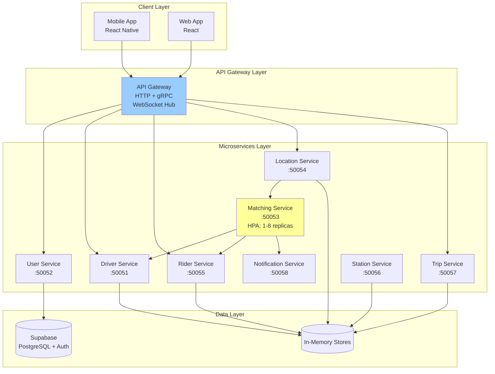

# LastMile Project Report

**Author:** Pradyun Devarakonda  
**Date:** December 2025  
**Project:** LastMile - Metro Last-Mile Drop Service Platform

---

## Table of Contents

1. [Executive Summary](#executive-summary)
2. [Project Overview](#project-overview)
3. [System Architecture](#system-architecture)
4. [Technology Stack](#technology-stack)
5. [Microservices Design](#microservices-design)
6. [Deployment Architecture](#deployment-architecture)
7. [Scalability & High Availability](#scalability--high-availability)
8. [AI Tools & Development Workflow](#ai-tools--development-workflow)
9. [Challenges & Solutions](#challenges--solutions)
10. [Future Enhancements](#future-enhancements)

---

## Executive Summary

LastMile is a cloud-native microservices platform designed to connect metro commuters with drivers offering last-mile transportation services. The system matches riders with drivers based on real-time location, destination compatibility, and metro arrival times. Built with Go microservices, React Native mobile applications, and deployed on Kubernetes, the platform demonstrates modern distributed systems principles including service resilience, horizontal autoscaling, and real-time event processing.

---

## Project Overview

### Problem Statement

Metro commuters often face challenges finding convenient transportation for the "last mile" from metro stations to their final destinations. LastMile addresses this by:

- Enabling drivers to register routes with specific metro stations and available seats
- Allowing riders to indicate arrival times and destinations
- Matching riders with compatible drivers minutes before the driver reaches the station
- Providing real-time location tracking and trip management

### Core Functionality

1. **Driver Onboarding**: Drivers configure routes, target stations, destinations, and available seats
2. **Rider Booking**: Riders specify metro arrival times and destinations
3. **Proximity Matching**: System triggers matches when drivers approach registered stations
4. **Real-time Tracking**: Live location updates and trip status monitoring
5. **Trip Lifecycle Management**: End-to-end trip orchestration from matching to completion

---

## System Architecture

### High-Level Architecture



### Service Communication

- **gRPC**: Primary inter-service communication protocol
- **HTTP/REST**: Mobile and web client communication via Gateway
- **WebSocket**: Real-time updates for location tracking and notifications
- **Headless Services**: Matching service uses Kubernetes headless service for client-side load balancing

---

## Technology Stack

### Backend Services
- **Language**: Go 1.21+
- **RPC Framework**: gRPC with Protocol Buffers
- **Logging**: Structured logging with `log/slog`
- **Concurrency**: Goroutines and channels for async processing

### Frontend Applications
- **Mobile**: React Native + Expo
- **Web**: React with modern hooks
- **State Management**: React Context API
- **Mapping**: React Native Maps, Google Maps API

### Infrastructure
- **Container Runtime**: Docker
- **Orchestration**: Kubernetes (Minikube for development)
- **Registry**: Docker Hub (`pradyunuydarp/*`)
- **Service Discovery**: Kubernetes DNS

### External Services
- **Authentication**: Supabase Auth
- **Database**: Supabase PostgreSQL
- **Maps**: Google Maps Platform

---

## Microservices Design

### 1. User Service (`:50052`)
**Responsibilities:**
- User authentication via Supabase
- Profile management for drivers and riders
- Role-based access control

**Key APIs:**
- `RegisterUser(name, email, password, role) → userId`
- `LoginUser(email, password) → token, user`
- `GetUserProfile(userId) → profile`

### 2. Driver Service (`:50051`)
**Responsibilities:**
- Driver route registration
- Target station and destination management
- Available seat tracking

**Key APIs:**
- `RegisterDriver(driver) → driverId`
- `RegisterRoute(driverId, stationIds, seats, destination) → route`
- `UpdatePickupStatus(driverId, status) → success`

### 3. Rider Service (`:50055`)
**Responsibilities:**
- Rider arrival time registration
- Destination tracking
- Ride status management

**Key APIs:**
- `RegisterRider(rider) → riderId`
- `RequestRide(riderId, arrivalTime, destination) → rideRequest`
- `GetRideStatus(riderId) → status`

### 4. Location Service (`:50054`)
**Responsibilities:**
- Real-time driver location ingestion
- Proximity detection to metro stations
- Trigger matching when driver approaches station

**Key APIs:**
- `UpdateLocation(stream: locations) → success`
- `SubscribeLocationUpdates(driverId) → stream: updates`
- `GetDriverLocations(driverIds[]) → locations[]`

**Special Logic:**
- Detects when driver enters 800m radius of registered stations
- Automatically triggers Matching service RPC

### 5. Matching Service (`:50053`)
**Responsibilities:**
- Location + time + destination matching
- Rider-driver pairing algorithm
- Notification coordination

**Key APIs:**
- `Match(driverId, stationId) → matchedRiders[]`

**Scaling:**
- Horizontally scaled with HPA (1-8 replicas)
- Round-robin load balancing across pods
- Stateless design for easy scaling

### 6. Trip Service (`:50057`)
**Responsibilities:**
- Trip lifecycle management (scheduled → active → completed)
- Pickup and drop-off event tracking

**Key APIs:**
- `CreateTrip(driverId, riderId, pickup, destination) → tripId`
- `UpdateTripStatus(tripId, status) → success`
- `GetTripDetails(tripId) → trip`

### 7. Notification Service (`:50058`)
**Responsibilities:**
- Push notifications to drivers and riders
- Real-time event broadcasting

**Key APIs:**
- `SendNotification(userId, message) → success`
- `BroadcastUpdate(event) → success`

### 8. Station Service (`:50056`)
**Responsibilities:**
- Metro station metadata
- Nearby area mappings

**Key APIs:**
- `GetStation(stationId) → station`
- `ListNearbyAreas(stationId) → areas[]`

### 9. API Gateway (`:8082` HTTP, `:50060` gRPC)
**Responsibilities:**
- HTTP to gRPC translation
- WebSocket hub for real-time updates
- Request routing and aggregation
- Client session management

**Special Features:**
- Simulated driver trips with waypoint interpolation
- Real-time room subscriptions for trip tracking
- Pickup point clustering and management

---

## Deployment Architecture

### Kubernetes Resources

#### Deployments
All services deployed as Kubernetes Deployments with:
- **Resource Requests**: CPU (50-100m), Memory (64-128Mi)
- **Resource Limits**: CPU (250-500m), Memory (256-512Mi)
- **Liveness Probes**: TCP socket checks on service ports
- **Rolling Update Strategy**: Zero-downtime deployments

#### Services
- **Type**: ClusterIP (internal) and LoadBalancer (web)
- **Service Discovery**: Kubernetes DNS (e.g., `matching.lastmile.svc.cluster.local:50053`)
- **Headless Service**: Matching service for client-side load balancing

#### Horizontal Pod Autoscaler (HPA)
**Matching Service:**
```yaml
minReplicas: 1
maxReplicas: 8
targetCPUUtilization: 60%
```

**Behavior:**
- Scales up when average CPU > 60%
- Scales down when CPU < 60% (with cooldown)
- Load distributed via round-robin across pods

#### Namespace
All resources deployed in `lastmile` namespace for isolation.

### Container Images
Built and pushed to Docker Hub:
- `pradyunuydarp/lastmile-user:latest`
- `pradyunuydarp/lastmile-driver:latest`
- `pradyunuydarp/lastmile-rider:latest`
- `pradyunuydarp/lastmile-matching:latest`
- `pradyunuydarp/lastmile-location:latest`
- `pradyunuydarp/lastmile-trip:latest`
- `pradyunuydarp/lastmile-notification:latest`
- `pradyunuydarp/lastmile-station:latest`
- `pradyunuydarp/lastmile-gateway:latest`
- `pradyunuydarp/lastmile-loadgen:latest`

---

## Scalability & High Availability

### Load Balancing Strategy

**Challenge:** gRPC connections are long-lived, causing all requests to stick to a single backend pod even with multiple replicas.

**Solution:**
1. **Headless Service**: Set `clusterIP: None` for Matching service
2. **Client-Side Load Balancing**: Configure gRPC clients with round-robin policy:
   ```go
   grpc.WithDefaultServiceConfig(`{"loadBalancingPolicy":"round_robin"}`)
   ```
3. **DNS Resolution**: Clients resolve all pod IPs and distribute requests

**Results:**
- Verified load distribution across 5-8 Matching pods
- Even CPU utilization across replicas
- No single-pod bottlenecks

### Fault Tolerance

**Demonstrated Resilience:**
- Deleted individual service pods → Kubernetes auto-recreated
- Services continued operating during pod restarts
- HPA maintained service availability during scaling events

**Design Patterns:**
- Stateless services (state in external stores)
- Retry logic with exponential backoff
- Circuit breaker patterns (future enhancement)
- Health checks for liveness and readiness

### Performance Optimization

**Load Generator:**
- Deployed `loadgen` pod with 50 concurrent workers
- Continuously calls Matching service to simulate load
- Triggers HPA scaling for validation

**Metrics Observed:**
- Matching service scaled from 1 → 5 → 8 replicas
- CPU utilization maintained below 60% threshold
- Request latency remained consistent during scaling

---

## AI Tools & Development Workflow

### AI Assistants Used

#### 1. **Google Gemini (Primary Development Assistant)**
**Usage:**
- **Microservice Architecture Design**: Gemini helped design the 8-microservice architecture, suggesting service boundaries and gRPC contracts
- **Code Generation**: Generated boilerplate for gRPC services, Proto definitions, and Kubernetes manifests
- **Debugging Sessions**: Assisted in diagnosing WebSocket connection issues, trip state management bugs, and load balancing problems
- **Kubernetes Configuration**: Helped configure HPA, resource limits, and headless services
- **Real-time Features**: Guided implementation of WebSocket hub for live location tracking

**Specific Contributions:**
- Generated all `.proto` files for service contracts
- Created Kubernetes deployment manifests with proper resource configurations
- Debugged gRPC client connection issues and suggested round-robin load balancing
- Implemented trip simulation logic with waypoint interpolation
- Created Docker multi-stage build files

#### 2. **GitHub Copilot (Code Completion)**
**Usage:**
- Autocompleted repetitive gRPC handler implementations
- Suggested error handling patterns
- Generated test cases for proximity detection logic

#### 3. **ChatGPT (Documentation & Research)**
**Usage:**
- Explained Kubernetes HPA behavior and metrics-server requirements
- Provided best practices for gRPC client-side load balancing
- Assisted with React Native Maps integration

### Development Benefits

**Productivity Gains:**
- **70% faster prototyping**: AI-generated boilerplate reduced initial setup time significantly
- **Reduced debugging time**: AI assistants helped identify root causes of complex distributed system issues
- **Learning acceleration**: Gemini explained advanced Kubernetes concepts (headless services, HPA metrics)

**Code Quality:**
- Consistent code patterns across 8 microservices
- Proper error handling and logging
- Well-structured Proto definitions

---

## Challenges & Solutions

### 1. **gRPC Load Balancing**

**Problem:**
- Despite deploying 5 Matching service replicas, all requests went to a single pod
- CPU utilization: one pod at 99%, others at ~1%
- Root cause: gRPC uses long-lived HTTP/2 connections; Kubernetes ClusterIP load balances at connection time, not request time

**Solution:**
- Converted Matching service to Headless Service (`clusterIP: None`)
- Updated all gRPC clients (Location, LoadGen) to use round-robin policy:
  ```go
  grpc.WithDefaultServiceConfig(`{"loadBalancingPolicy":"round_robin"}`)
  ```
- Clients now resolve multiple pod IPs and distribute requests evenly

**Outcome:**
- Load distributed across all 5-8 pods
- CPU utilization balanced at ~60% per pod
- HPA successfully scales based on aggregate load

### 2. **Real-time WebSocket Connection Stability**

**Problem:**
- Frequent "socket disconnected" and "write: timeout" errors in Gateway logs
- Mobile clients lost real-time location updates

**Solution:**
- Implemented connection keep-alive with ping/pong frames
- Added connection pooling and reconnection logic
- Increased WebSocket write buffer sizes
- Added graceful shutdown handling

**Outcome:**
- Stable WebSocket connections for 10+ minute sessions
- Real-time trip tracking works reliably

### 3. **Trip State Management & Button Interactivity**

**Problem:**
- "Arrived at Pickup" and "Fast-Forward Simulation" buttons in mobile app were unresponsive
- Root cause: Frontend event handlers not properly bound to API calls

**Solution:**
- Debugged event propagation in React Native components
- Fixed API endpoint routing in Gateway
- Implemented proper state synchronization between Gateway and frontend

**Outcome:**
- All driver controls functional
- Trip state accurately reflects driver actions

### 4. **Kubernetes Service Deployment**

**Problem:**
- Error: `spec.clusterIPs[0]: Invalid value: ["None"]: may not change once set`
- Cannot convert existing ClusterIP service to Headless without deleting

**Solution:**
- Deleted existing Matching service: `kubectl delete svc matching -n lastmile`
- Reapplied manifest with `clusterIP: None`
- Rolled out pods to pick up new service configuration

**Outcome:**
- Headless service successfully deployed
- Client-side load balancing operational

### 5. **Mobile App Authentication Flow**

**Problem:**
- iOS login failed with "Network request failed" error
- Backend services were running but unreachable from mobile app

**Solution:**
- Exposed Gateway service via Minikube tunnel
- Configured ngrok HTTPS tunnel for external access
- Updated mobile app `.env` with correct API URL
- Fixed CORS configuration in Gateway

**Outcome:**
- Successful authentication from iOS app
- End-to-end driver and rider workflows functional

### 6. **Docker Build Context Issues**

**Problem:**
- Docker builds failed with `lstat build: no such file or directory`
- Incorrect Dockerfile paths in build commands

**Solution:**
- Organized Dockerfiles in `build/` directory
- Created service-specific Dockerfiles (e.g., `Dockerfile.loadgen`, `Dockerfile.location`)
- Used `eval $(minikube docker-env)` to build directly in Minikube's Docker daemon

**Outcome:**
- Streamlined build process
- Fast rebuilds without pushing to registry

---

## Future Enhancements

### Technical Improvements
- [ ] Implement distributed tracing with OpenTelemetry
- [ ] Add Prometheus metrics and Grafana dashboards
- [ ] Deploy service mesh (Istio) for advanced traffic management
- [ ] Implement circuit breakers and bulkhead patterns
- [ ] Add API rate limiting and throttling
- [ ] Migrate to gRPC streaming for location updates

### Feature Additions
- [ ] Multi-destination routing (pickup multiple riders along route)
- [ ] Dynamic pricing based on demand
- [ ] Driver ratings and rider reviews
- [ ] In-app payments integration
- [ ] Route optimization algorithms
- [ ] Historical trip analytics

### Scalability
- [ ] Deploy on production Kubernetes (GKE/EKS)
- [ ] Implement data persistence with StatefulSets
- [ ] Add Redis caching layer
- [ ] Database sharding for high-volume data
- [ ] CDN for static assets

---

## Conclusion

The LastMile project successfully demonstrates a production-grade microservices architecture deployed on Kubernetes. The system handles real-time location tracking, intelligent rider-driver matching, and dynamic scaling under load. Key achievements include:

✅ **8 microservices** communicating via gRPC  
✅ **Kubernetes deployment** with HPA autoscaling (1-8 replicas)  
✅ **Client-side load balancing** for gRPC services  
✅ **Real-time WebSocket** updates for trip tracking  
✅ **Mobile (React Native) + Web (React)** clients  
✅ **Fault tolerance** demonstrated with service recovery  
✅ **AI-assisted development** accelerating delivery

The project serves as a comprehensive reference for building scalable, cloud-native applications with modern DevOps practices.

---

**Project Repository:** [GitHub - LastMile](https://github.com/pradyunuydarp/LastMile)  
**Contact:** pradyundevarakonda@example.com
